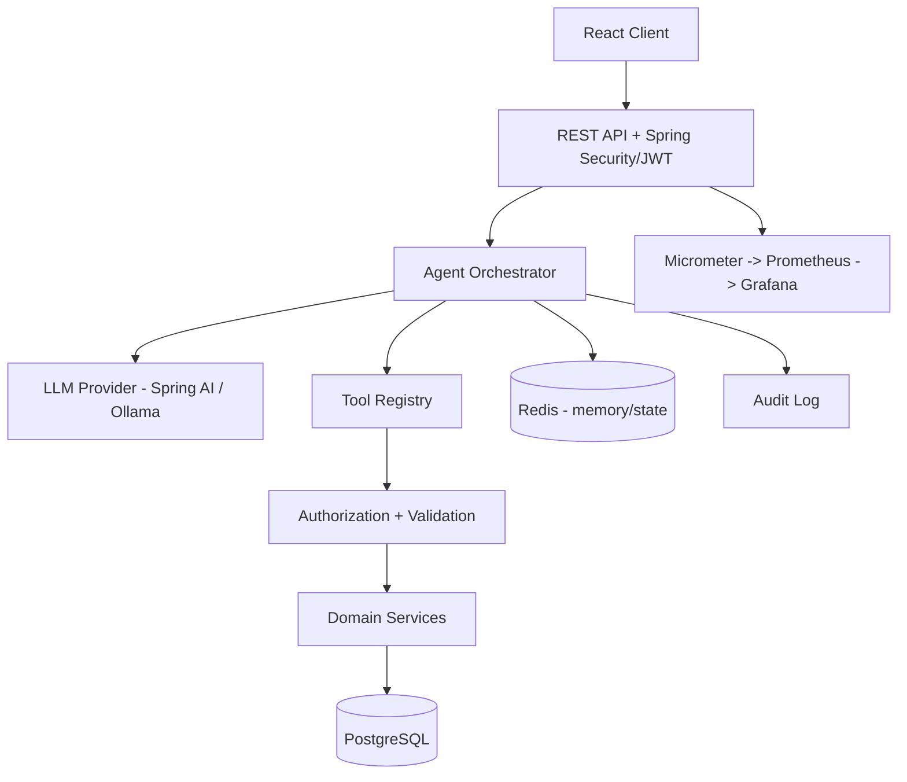

# Agentic AI Task Orchestrator

> **Project status: 🟢 Milestone 2 — Authentication & Authorization (complete & verified).** JWT auth (register/login), BCrypt, RBAC (USER/ADMIN), a stateless security filter, and user/role persistence via Flyway are implemented and tested (39 tests green). Everything below marked _Planned_ describes the intended system, not shipped functionality. See [`docs/ROADMAP.md`](docs/ROADMAP.md) and [`docs/CHANGELOG.md`](docs/CHANGELOG.md).

## Overview

Agentic AI Task Orchestrator is a secure, production-style backend where a user submits a natural-language objective and an LLM-driven **agent** completes it by selecting and executing **explicitly registered, permission-controlled backend tools** — observing each result and continuing until the task is done or a bound is hit.

The defining principle: **the LLM decides _what_ tool to call; the backend decides _whether_ it is allowed and _how_ it actually executes.** The model never touches the database or infrastructure directly.

**Example objective:**
> "Find all my overdue tasks, calculate the total estimated hours, and create a high-priority follow-up task."

**Planned agent execution:** search overdue tasks → inspect results → calculate total hours → create follow-up task → return an auditable execution summary.

## Why This Project?

It is built to demonstrate that a candidate can build an **AI-enabled backend system**, not merely call an LLM API. It exercises tool/function calling, multi-step orchestration, guardrails, authorization of AI-initiated actions, memory, observability, auditability, and evaluation — the parts that make agentic AI safe to run in production. See [`docs/PROJECT_CHARTER.md`](docs/PROJECT_CHARTER.md).

## Key Capabilities (Planned)

- **Agent orchestration** — bounded, multi-step tool execution with observation loops.
- **Tool registry** — typed, validated, authorized, audited capabilities classified by risk (read-only → deterministic → side-effecting → high-risk).
- **Guardrails** — max tool calls, timeouts, retry limits, loop detection, confirmation for dangerous operations, output validation.
- **Security** — JWT auth, RBAC, per-resource ownership checks enforced _before_ any tool runs.
- **Memory** — Redis for conversation/session/execution state; PostgreSQL for durable data.
- **Observability & audit** — correlation/execution IDs, metrics, and a full audit trail of agent decisions and side effects.
- **Evaluation** — a reproducible suite scoring tool-selection and argument accuracy, refusal behavior, and task completion.

## Architecture (Planned)



Full detail: [`docs/SYSTEM_ARCHITECTURE.md`](docs/SYSTEM_ARCHITECTURE.md) and [`docs/AGENT_ARCHITECTURE.md`](docs/AGENT_ARCHITECTURE.md).

## Technology Stack (Direction)

Java 21 · Spring Boot 3.x · Spring AI · Ollama (local) · PostgreSQL · Redis · Spring Security (JWT + RBAC) · Spring Data JPA · Maven · SpringDoc OpenAPI · JUnit 5 · Mockito · Testcontainers · Docker / Docker Compose · Micrometer / Prometheus / Grafana · React + Vite + TypeScript (later). Rationale for each: [`docs/TECH_STACK.md`](docs/TECH_STACK.md).

## Security

The LLM is treated as an **untrusted planner**, never a security boundary. Every side-effecting tool authorizes the authenticated user against the target resource before execution; arguments are validated; dangerous operations require confirmation. Threats specific to agentic systems (prompt injection, unauthorized tool invocation, data exfiltration, destructive actions) are catalogued with mitigations in [`docs/THREAT_MODEL.md`](docs/THREAT_MODEL.md) and [`docs/SECURITY.md`](docs/SECURITY.md).

## Observability

Structured logging with correlation, request, agent-execution, and tool-execution IDs; metrics for latency, failure rate, tool-execution counts, and LLM request duration via Micrometer → Prometheus → Grafana. See [`docs/OBSERVABILITY.md`](docs/OBSERVABILITY.md) and [`docs/AUDIT_LOGGING.md`](docs/AUDIT_LOGGING.md).

## Testing

Unit (services, tools, validators, security) · integration (Testcontainers: Postgres, Redis, API) · agent/AI behavior (tool selection, argument validation, failure recovery, confirmation, injection resistance) · end-to-end (request → agent → tools → result). See [`docs/TESTING.md`](docs/TESTING.md) and [`docs/EVALUATION.md`](docs/EVALUATION.md).

## Roadmap

Milestones 0–14, from Starter Kit through Backend Foundation, Auth, Core Domain, Spring AI, Tool Registry, Agent Orchestration, Memory, Guardrails, Auditing, Observability, Testing/Evaluation, Docker/Deployment, Frontend/Demo, and Portfolio Finalization. Full detail: [`docs/ROADMAP.md`](docs/ROADMAP.md).

## Local Development

**Build & test (no infrastructure needed).** The full test suite runs against H2 executing the real migrations — Java 21 only:

```bash
cd backend && ./mvnw verify
```

**Run the app (Milestone 2).** Running now requires a PostgreSQL and security env vars. Copy [`.env.example`](.env.example) to `.env`, set `DATABASE_*`, `JWT_SECRET` (≥32 chars), then:

```bash
cd backend && ./mvnw spring-boot:run
```

Then register, log in, and call a protected endpoint:

```bash
curl -X POST http://localhost:8080/api/v1/auth/register -H 'Content-Type: application/json' -d '{"email":"you@example.com","password":"ExamplePassword123!"}'
```

Open [http://localhost:8080/swagger-ui.html](http://localhost:8080/swagger-ui.html), log in via `/api/v1/auth/login`, click **Authorize**, and call `GET /api/v1/me`.

> _Planned (Milestone 12)._ The full one-command stack (`docker-compose up --build`, bringing up PostgreSQL, Redis, Ollama, Prometheus, Grafana, and the frontend) is not implemented yet. Copy [`.env.example`](.env.example) to `.env` when those services arrive; M1 itself needs no environment variables. See [`docs/DEPLOYMENT.md`](docs/DEPLOYMENT.md).

## Project Status

| Area | Status |
|---|---|
| Engineering governance (docs, rules, commands, prompts) | ✅ Implemented (M0) |
| Backend foundation (Spring Boot skeleton, health, error model, OpenAPI, CI) | ✅ Implemented & verified (M1) |
| Authentication & authorization (JWT, BCrypt, RBAC, user/role persistence) | ✅ Implemented & verified (M2) |
| Authentication / RBAC | ⬜ Planned (M2) |
| Core domain (tasks, customers) | ⬜ Planned (M3) |
| Spring AI + tool registry | ⬜ Planned (M4–M5) |
| Agent orchestration | ⬜ Planned (M6) |
| Memory / guardrails / audit | ⬜ Planned (M7–M9) |
| Observability | ⬜ Planned (M10) |
| Testing / evaluation | ⬜ Planned (M11) |
| Docker / deployment | ⬜ Planned (M12) |
| Frontend / demo | ⬜ Planned (M13) |

## Engineering Philosophy

Simplicity before cleverness · explicit boundaries · security and observability by default · the LLM proposes, the backend disposes · evidence before assertions. Nothing is documented as done until it is implemented and verified.

## License

TBD.
