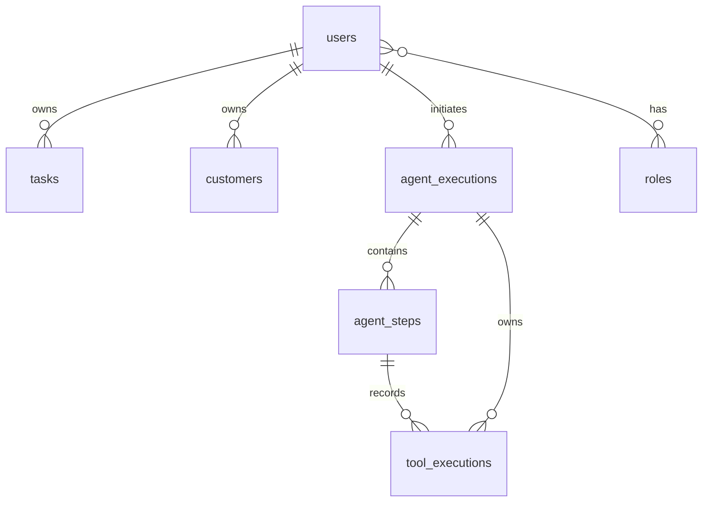

# Database Design
## Agentic AI Task Orchestrator

> Conceptual model. No schema, entities, or migrations exist yet (planned M3+). Durable data only — ephemeral state lives in Redis (`MEMORY.md`).

> **Status:** Persistence is **live as of Milestone 2** (Spring Data JPA + PostgreSQL + Flyway),
> introduced for the security domain (users/roles) — this brought the M1-deferred stack forward
> (see ADR-0002 → superseded for security data by ADR-0003/0005). `DATABASE_URL`/`DATABASE_USERNAME`/
> `DATABASE_PASSWORD` are now **required**. The first **business tables `tasks` and `customers` are
> implemented as of Milestone 3** (§0b), verified against real PostgreSQL via Testcontainers. The
> remaining tables (agent/tool executions, audit) stay PLANNED for later milestones.

## 0. Implemented schema (M2) — VERIFIED

Flyway migrations in `backend/src/main/resources/db/migration/`:

- `V1__create_users_and_roles.sql` — `users`, `roles`, `user_roles`.
- `V2__seed_roles.sql` — seeds `ROLE_USER`, `ROLE_ADMIN` (safe role rows only; **no users/passwords seeded**).

| Table | Columns | Constraints / indexes |
|---|---|---|
| `users` | `id` (BIGINT identity PK), `email`, `password_hash`, `enabled`, `created_at`, `updated_at` (TIMESTAMPTZ) | `UNIQUE(email)` (`uq_users_email`); email stored normalized (lower-cased) |
| `roles` | `id` (BIGINT identity PK), `name` | `UNIQUE(name)` (`uq_roles_name`); name = Spring authority (`ROLE_USER`/`ROLE_ADMIN`) |
| `user_roles` | `user_id`, `role_id` | composite PK; FKs to `users`/`roles` `ON DELETE CASCADE`; `idx_user_roles_role_id` on the inverse side |

**Password storage:** only a BCrypt hash in `users.password_hash`; never plaintext, never returned by any API, never logged. **PK strategy:** `BIGINT GENERATED BY DEFAULT AS IDENTITY` (ADR-0003). **Portability:** migrations use SQL-standard constructs so they run on both PostgreSQL (local/prod) and H2-in-PostgreSQL-mode (tests) — schema owned by Flyway, `ddl-auto: none` (ADR-0005).

## 0b. Implemented schema (M3) — VERIFIED

Flyway migrations: `V3__create_tasks.sql`, `V4__create_customers.sql`. Ownership FK column is
**`owner_id`** → `users(id)` `ON DELETE CASCADE`, assigned server-side from the authenticated
principal (ADR-0006). PK strategy `BIGINT GENERATED BY DEFAULT AS IDENTITY` (ADR-0007). Enums stored
as `VARCHAR` with a mirroring `CHECK`.

| Table | Columns | Constraints / indexes |
|---|---|---|
| `tasks` | `id` (PK), `owner_id`, `title` (≤200, NOT NULL), `description` (≤2000), `status` (VARCHAR20, default `TODO`), `priority` (VARCHAR20, default `MEDIUM`), `estimated_hours` (NUMERIC(6,2)), `due_date` (DATE), `created_at`/`updated_at` (TIMESTAMPTZ) | `fk_tasks_owner` → `users(id)` CASCADE; `chk_tasks_status` ∈ {TODO,IN_PROGRESS,COMPLETED,CANCELLED}; `chk_tasks_priority` ∈ {LOW,MEDIUM,HIGH,CRITICAL}; `chk_tasks_estimated_hours` ≥ 0; indexes `idx_tasks_owner_id`, `idx_tasks_owner_created_at`, `idx_tasks_owner_status`, `idx_tasks_owner_priority`, `idx_tasks_owner_due_date` |
| `customers` | `id` (PK), `owner_id`, `name` (≤150, NOT NULL), `email` (≤255), `phone` (≤30), `status` (VARCHAR20, default `ACTIVE`), `created_at`/`updated_at` (TIMESTAMPTZ) | `fk_customers_owner` → `users(id)` CASCADE; `uq_customers_owner_email UNIQUE(owner_id, email)` (NULL emails allowed multiple); `chk_customers_status` ∈ {ACTIVE,INACTIVE}; indexes `idx_customers_owner_id`, `idx_customers_owner_created_at` |

**Ownership model:** a USER accesses only their own rows (queries are `owner_id`-scoped in SQL,
never filtered in Java); a non-owner request for an existing id returns 404 (existence-masking); an
ADMIN may act on any single row by id. `due_date` is a calendar `DATE`/`LocalDate`; audit timestamps
are `Instant`/`TIMESTAMPTZ` (ADR-0007). A PostgreSQL-only note: nullable `String` filter params are
`CAST(... AS string)` in JPQL so PG can type the bind (see `CustomerRepository`).

## 0c. Implemented schema (M9) — VERIFIED

Flyway migration `V5__create_agent_audit.sql` adds the durable agent audit model — **three typed
tables**, superseding the earlier generic `audit_events` sketch (guardrail/confirmation outcomes are
typed `agent_steps`, not generic events). Written from backend-observed facts (never the LLM), each
table has a `BIGINT` identity PK plus a **UUID natural key** for idempotency (ADR-0026).

| Table | Columns (summary) | Constraints / indexes |
|---|---|---|
| `agent_executions` | `id` (PK), `execution_uid` (UUID), `owner_id`, `conversation_id`, `request_id`, `status`, `iterations`, `tool_calls`, `failure_code`, `final_response_summary` (≤600, bounded), `started_at`/`completed_at`/`created_at` (TIMESTAMPTZ), `duration_ms` | `uq_agent_executions_uid UNIQUE(execution_uid)`; `fk...owner`→`users` CASCADE; `chk...status` (STARTED/RUNNING/COMPLETED/FAILED/TIMED_OUT/CANCELLED/LIMIT_REACHED/LOOP_DETECTED/PENDING_CONFIRMATION/BLOCKED); indexes `(owner_id, started_at DESC)`, `(owner_id, conversation_id)`, `(owner_id, status)` |
| `agent_steps` | `id` (PK), `execution_id`, `sequence`, `step_type`, `status`, `tool_name`, `detail_code`, `started_at`/`completed_at`, `duration_ms` | `uq_agent_steps_exec_seq UNIQUE(execution_id, sequence)`; `fk...execution` CASCADE; `chk...type` (LLM_DECISION/GUARDRAIL/TOOL_CALL/CONFIRMATION_*/FINAL/FAILURE); `chk...status` (OK/FAILED/BLOCKED/REQUIRED); index `(execution_id)` |
| `tool_executions` | `id` (PK), `tool_execution_uid` (UUID), `step_id`, `execution_id`, `owner_id`, `tool_name`, `risk_level`, `outcome`, `error_code`, `confirmation_id`, `arguments_hash` (SHA-256 CHAR(64)), `result_summary` (≤600, bounded), `started_at`/`completed_at`, `duration_ms` | `uq_tool_executions_uid UNIQUE(tool_execution_uid)`; FKs → `agent_steps`/`agent_executions`/`users` CASCADE; `chk...risk`, `chk...outcome` (SUCCESS/FAILED/DENIED/NOT_EXECUTED/CONFIRMATION_REQUIRED/TIMEOUT); indexes `(owner_id, started_at DESC)`, `(execution_id)`, `(tool_name)` |

**Privacy:** stores only safe metadata + hashes + bounded summaries — **never** raw prompts, tool
arguments, LLM output, chain-of-thought, or secrets (ADR-0028, `DATA_PRIVACY.md`). **Writes** are
best-effort in their own `REQUIRES_NEW` transactions, idempotent via the UNIQUE natural keys, and never
block the agent path (ADR-0027). **Reads** are owner-scoped via JPA Specifications, paginated, and
sanitized (ADR-0029). Retention horizon is documented (`AGENT_AUDIT_RETENTION_DAYS`, default 90); **no
purge scheduler in M9**.

## 1. Entities (conceptual)

| Entity | Purpose | Owner |
|---|---|---|
| `users` | Accounts: credentials (BCrypt hash), status | self |
| `roles` | RBAC roles (USER, ADMIN); user↔role mapping | system |
| `tasks` | User tasks: title, description, status, priority, estimated hours, due date | user |
| `customers` | User's customer records: name, contact, metadata | user |
| `agent_executions` | One row per agent run: status, counts, timestamps, bounded final summary (M9, IMPLEMENTED) | user |
| `agent_steps` | Ordered agent transitions: LLM decision, guardrail, confirmation, tool-call, final (M9, IMPLEMENTED) | via execution |
| `tool_executions` | One row per tool call: tool, risk, outcome, error, args hash, bounded result summary (M9, IMPLEMENTED) | via execution / user |
| `conversations` / `messages` | Not durable — conversation context stays in Redis (M7). Audit stores only the `conversation_id`, never the memory blob. | user |

## 2. Relationships

- Ownership FKs on the business tables: `tasks.owner_id` and `customers.owner_id` → `users(id)` (implemented, M3); `agent_executions.user_id` (planned).
- `tool_executions.execution_id` → `agent_executions.id`.
- `audit_events` reference `user_id`, `execution_id`, and carry `correlation_id`.

## 3. Conventions

- `snake_case` table/column names; surrogate primary keys are `BIGINT GENERATED BY DEFAULT AS IDENTITY` (resolved in ADR-0007 — consistent with `users`; UUIDs were considered and rejected). Resource-ownership FK columns are named `owner_id`.
- Timestamps as `TIMESTAMPTZ` → `Instant`/`OffsetDateTime`.
- Ownership FKs `ON DELETE CASCADE` at the DB level; cascade/orphanRemoval mirrored in JPA where appropriate.
- Enumerations (task status/priority, execution status, tool outcome) stored as constrained strings or DB enums, mirrored by Java enums.

## 4. Indexing strategy

- Index every FK (`owner_id` on business tables, `user_id`/`execution_id` on planned tables).
- Index hot-path filters/sorts. Implemented (M3): `tasks(owner_id)`, `tasks(owner_id, created_at)`, `tasks(owner_id, status)`, `tasks(owner_id, priority)`, `tasks(owner_id, due_date)`, `customers(owner_id)`, `customers(owner_id, created_at)`. Planned: `agent_executions(user_id, created_at)`, `audit_events(execution_id)`, `audit_events(user_id, created_at)`.
- Every list query is paginated; no unindexed sort on a large table.

## 5. Transactions

- Multi-write operations run in a single `@Transactional` unit; reads use `readOnly = true`.
- **No transaction spans an LLM or external tool call.** Load data, commit, then call the model; persist results in a new transaction.

## 6. Migrations (Flyway)

- All schema changes via versioned migrations in `db/migration/` (e.g. `V1__init.sql`). Never edit an applied migration; add a new one.
- Migrations are forward-only and reviewed; backfill/rollback considerations noted in the PR.
- JPA entities are kept in sync with the DDL and this doc; DTOs at the API boundary (never expose entities).

## 7. Durable vs ephemeral (must stay separate)

Durable → Postgres (this doc). Ephemeral conversation/session/execution *working* state and caches → Redis with TTLs (`MEMORY.md`). The **outcome** of an execution is persisted here even though its in-flight working state lived in Redis.

## 8. Audit as first-class data

`agent_executions`, `tool_executions`, and `audit_events` are core domain tables, not an afterthought — they make the agent auditable and evaluable (`AUDIT_LOGGING.md`, `EVALUATION.md`).
