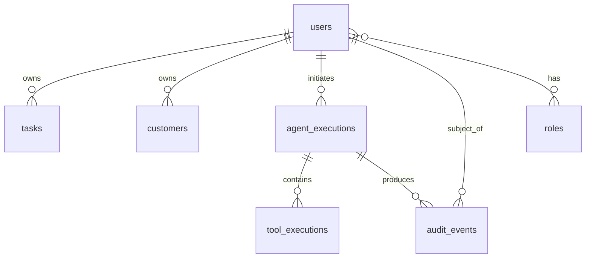

# Database Design
## Agentic AI Task Orchestrator

> Conceptual model. No schema, entities, or migrations exist yet (planned M3+). Durable data only — ephemeral state lives in Redis (`MEMORY.md`).

> **Status:** Persistence is **live as of Milestone 2** (Spring Data JPA + PostgreSQL + Flyway),
> introduced for the security domain (users/roles) — this brought the M1-deferred stack forward
> (see ADR-0002 → superseded for security data by ADR-0003/0005). `DATABASE_URL`/`DATABASE_USERNAME`/
> `DATABASE_PASSWORD` are now **required**. Business tables (tasks, customers, agent/tool executions,
> audit) remain PLANNED for M3+.

## 0. Implemented schema (M2) — VERIFIED

Flyway migrations in `backend/src/main/resources/db/migration/`:

- `V1__create_users_and_roles.sql` — `users`, `roles`, `user_roles`.
- `V2__seed_roles.sql` — seeds `ROLE_USER`, `ROLE_ADMIN` (safe role rows only; **no users/passwords seeded**).

| Table | Columns | Constraints / indexes |
|---|---|---|
| `users` | `id` (BIGINT identity PK), `email`, `password_hash`, `enabled`, `created_at`, `updated_at` (TIMESTAMPTZ) | `UNIQUE(email)` (`uq_users_email`); email stored normalized (lower-cased) |
| `roles` | `id` (BIGINT identity PK), `name` | `UNIQUE(name)` (`uq_roles_name`); name = Spring authority (`ROLE_USER`/`ROLE_ADMIN`) |
| `user_roles` | `user_id`, `role_id` | composite PK; FKs to `users`/`roles` `ON DELETE CASCADE`; `idx_user_roles_role_id` on the inverse side |

**Password storage:** only a BCrypt hash in `users.password_hash`; never plaintext, never returned by any API, never logged. **PK strategy:** `BIGINT GENERATED BY DEFAULT AS IDENTITY` (ADR-0003). **Portability:** migrations use SQL-standard constructs so they run on both PostgreSQL (local/prod) and H2-in-PostgreSQL-mode (tests) — schema owned by Flyway, `ddl-auto: none` (ADR-0005).

## 1. Entities (conceptual)

| Entity | Purpose | Owner |
|---|---|---|
| `users` | Accounts: credentials (BCrypt hash), status | self |
| `roles` | RBAC roles (USER, ADMIN); user↔role mapping | system |
| `tasks` | User tasks: title, description, status, priority, estimated hours, due date | user |
| `customers` | User's customer records: name, contact, metadata | user |
| `agent_executions` | One row per agent run: objective, status, timestamps, user | user |
| `tool_executions` | One row per tool call within a run: tool name, args (redacted), result summary, outcome | via execution |
| `audit_events` | Durable audit trail (`AUDIT_LOGGING.md`) | system |
| `conversations` / `messages` | Only if durable conversation history is required; otherwise conversation context stays in Redis | user |

## 2. Relationships

- Ownership FKs (`user_id`) on `tasks`, `customers`, `agent_executions`.
- `tool_executions.execution_id` → `agent_executions.id`.
- `audit_events` reference `user_id`, `execution_id`, and carry `correlation_id`.

## 3. Conventions

- `snake_case` table/column names; surrogate primary keys (UUID or bigserial — chosen via ADR at M3).
- Timestamps as `TIMESTAMPTZ` → `Instant`/`OffsetDateTime`.
- Ownership FKs `ON DELETE CASCADE` at the DB level; cascade/orphanRemoval mirrored in JPA where appropriate.
- Enumerations (task status/priority, execution status, tool outcome) stored as constrained strings or DB enums, mirrored by Java enums.

## 4. Indexing strategy

- Index every FK (`user_id`, `execution_id`).
- Index hot-path filters/sorts: `tasks(user_id, status)`, `tasks(user_id, due_date)`, `agent_executions(user_id, created_at)`, `audit_events(execution_id)`, `audit_events(user_id, created_at)`.
- Every list query is paginated; no unindexed sort on a large table.

## 5. Transactions

- Multi-write operations run in a single `@Transactional` unit; reads use `readOnly = true`.
- **No transaction spans an LLM or external tool call.** Load data, commit, then call the model; persist results in a new transaction.

## 6. Migrations (Flyway)

- All schema changes via versioned migrations in `db/migration/` (e.g. `V1__init.sql`). Never edit an applied migration; add a new one.
- Migrations are forward-only and reviewed; backfill/rollback considerations noted in the PR.
- JPA entities are kept in sync with the DDL and this doc; DTOs at the API boundary (never expose entities).

## 7. Durable vs ephemeral (must stay separate)

Durable → Postgres (this doc). Ephemeral conversation/session/execution *working* state and caches → Redis with TTLs (`MEMORY.md`). The **outcome** of an execution is persisted here even though its in-flight working state lived in Redis.

## 8. Audit as first-class data

`agent_executions`, `tool_executions`, and `audit_events` are core domain tables, not an afterthought — they make the agent auditable and evaluable (`AUDIT_LOGGING.md`, `EVALUATION.md`).
