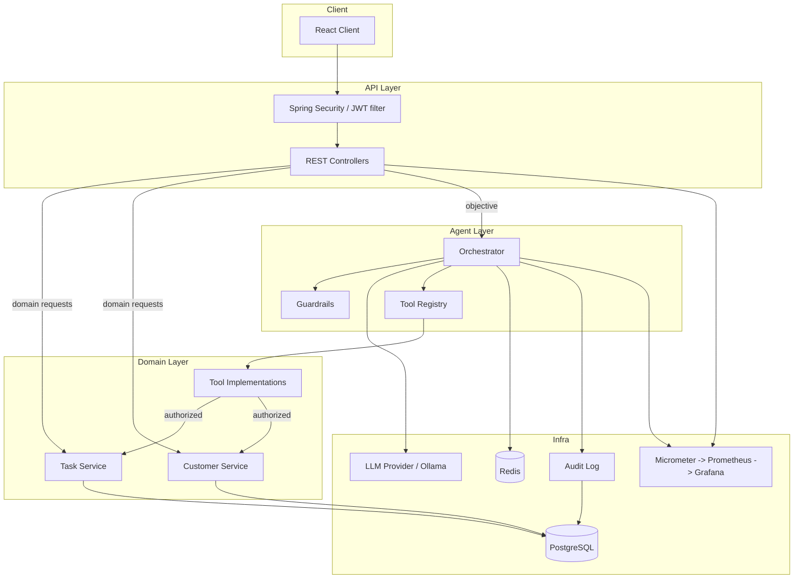

# System Architecture
## Agentic AI Task Orchestrator

> Conceptual architecture. Implementation details may evolve; boundaries are the stable part. Nothing here is built yet (Milestone 0).

## 1. Components

## 2. Layer responsibilities

- **Client** — collects the objective and renders results/history. No business logic.
- **API layer** — authentication (JWT), authorization entrypoint, request validation, DTO mapping, error envelope. Controllers delegate; they hold no logic.
- **Agent layer** — the orchestrator drives the decision loop; **guardrails** bound it; the **tool registry** exposes only permitted, typed tools. This layer decides *sequencing*, never authorization semantics (tools own that).
- **Domain layer** — task/customer business logic and the tool implementations that wrap it. Fully usable without the agent.
- **Infra** — Postgres (durable), Redis (ephemeral state/cache), the LLM provider (behind an abstraction), the audit log, and metrics.

## 3. Two request paths

**a) Direct REST (deterministic):** `Client → Security → Controller → Service → Repository → Postgres`. Standard CRUD; no model involved.

**b) Agentic:** `Client → Security → Controller → Orchestrator → (LLM decision) → Guardrails → Tool Registry → Tool (authorize + validate) → Domain Service → Postgres`, looping on observations, with state in Redis and every step audited. See `AGENT_ARCHITECTURE.md`.

## 4. Key architectural decisions

- **The agent layer is separate from domain logic.** The model orchestrates; it does not *contain* business rules.
- **The LLM is behind a provider abstraction.** No feature couples to a vendor SDK.
- **Tools are the only bridge from the agent to data**, and every tool authorizes and validates before acting.
- **Postgres is authoritative; Redis is disposable.** Losing Redis loses in-flight convenience state, never durable data.
- **Observability and audit are cross-cutting**, attached via correlation/execution IDs, not bolted on per feature.

## 5. Cross-cutting concerns

Security (`SECURITY.md`, `THREAT_MODEL.md`) · error handling (`ERROR_HANDLING.md`) · observability (`OBSERVABILITY.md`) · audit (`AUDIT_LOGGING.md`) · guardrails (`GUARDRAILS.md`) · data privacy (`DATA_PRIVACY.md`).

## 6. What is intentionally NOT here (yet)

No microservices, message bus, service mesh, or distributed tracing. Single deployable Spring Boot app + Postgres + Redis + Ollama. Complexity is added only when a requirement and an ADR justify it (`TECH_STACK.md`).
